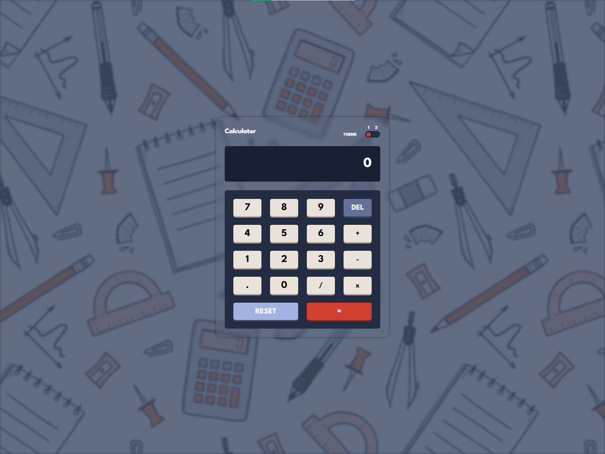

# 🧮 Calculator.js

> A modern calculator built with **Vanilla JavaScript**, featuring keyboard support, animated mechanical buttons, and an accessible two-theme interface.



## 🔗 Live Demo

**Demo:** https://hatem-create.github.io/Calculator.js/ *(Update if different)*

## 🎯 Overview

This project started as a simple calculator challenge but evolved into a polished frontend application focused on **clean architecture**, **user experience**, and **maintainable JavaScript**.

Rather than relying on frameworks or libraries, every interaction is implemented using modern HTML, CSS, and JavaScript.

The project demonstrates:

* DOM manipulation
* Event-driven architecture
* State management
* Keyboard interaction
* Theme switching
* Responsive UI
* CSS Custom Properties
* Reusable JavaScript functions

---

## ✨ Features

### 🔢 Calculator Engine

* Addition
* Subtraction
* Multiplication
* Division
* Decimal support
* Delete last character
* Reset calculator
* Expression execution

---

### ⌨️ Full Keyboard Support

The calculator works exactly like a desktop calculator.

| Key       | Action     |
| --------- | ---------- |
| 0-9       | Numbers    |
| .         | Decimal    |
| + - * /   | Operations |
| Backspace | Delete     |
| Enter     | Calculate  |
| C         | Reset      |

Each keyboard press also triggers the same visual animation as a mouse click for a consistent experience.

---

### 🎨 Theme System

Two complete themes are available.

* Dark Theme
* Light Theme

The entire color palette changes dynamically using **CSS Variables**, avoiding duplicated stylesheets.

Theme switching is implemented with a single class toggle and CSS custom properties.

---

### 🎯 UX Improvements

* Prevents multiple decimal points
* Prevents leading zeros
* Maximum input length
* Button press animations
* Hover feedback
* Smooth theme transitions
* Responsive layout

---

## 🏗 Architecture

```
Calculator.js
│
├── index.html
├── style.css
├── script.js
├── preview.png
└── pattern.jpeg
```

### JavaScript Structure

```
UI
│
├── updateScreen()
├── toggleDarkTheme()
│
Logic
│
├── numberButtonHandler()
├── operationButtonHandler()
├── executeOperation()
├── deleteButtonHandler()
├── resetButtonHandler()
│
Keyboard Layer
│
└── keyboardWithHover()
```

The project separates:

* UI updates
* Business logic
* Event handling

making the code easier to extend and maintain.

---

## 🧠 Technical Highlights

### CSS

* CSS Variables
* CSS Grid
* Flexbox
* BEM Naming Convention
* Custom button depth using pseudo-elements
* Glassmorphism effect
* Smooth transitions
* Responsive layout

### JavaScript

* Event Delegation concepts
* State management
* DOM manipulation
* Keyboard API
* Functional programming style
* Reusable handlers
* Clean separation of responsibilities

---

## 📸 Screenshots

### Dark Theme


### Light Theme


---

## 🚀 Getting Started

Clone the repository

```bash
git clone https://github.com/hatem-create/Calculator.js.git
```

Go into the project

```bash
cd Calculator.js
```

Open

```
index.html
```

No installation required.

No dependencies.

No frameworks.

---

## 💡 Future Improvements

* Scientific mode
* Calculation history
* Memory operations (M+, MR, MC)
* Parentheses support
* Percentage operator
* Keyboard shortcuts overlay
* Theme persistence using Local Storage
* Unit conversion mode

---

## 🛠 Built With

* HTML5
* CSS3
* Vanilla JavaScript

---

## 📚 What I Practiced

This project was an opportunity to strengthen practical frontend engineering skills, including:

* Building an interactive UI without frameworks
* Designing reusable JavaScript functions
* Managing application state
* Writing scalable CSS with variables
* Creating responsive layouts
* Implementing keyboard accessibility
* Organizing code for readability and maintainability

---

## 👨‍💻 Author

**Hatem Elsharkawy**

GitHub: https://github.com/hatem-create

LinkedIn: https://www.linkedin.com/in/hatem-elsharkawy-8117723a6/

---

## ⭐ Why This Project Matters

Many calculator projects stop at making arithmetic work.

This implementation goes further by emphasizing software engineering practices:

* Maintainable code structure
* Clear separation of concerns
* Accessible keyboard interactions
* Consistent UI feedback
* Scalable theming with CSS variables
* Responsive design without external libraries

The result is a small project that reflects the same engineering principles used when building larger frontend applications.
